

# Evidence Board

**Короткая визуальная подборка: конфигурации, диагностика, маршрутизация и сетевые сервисы**

<kbd>netplan</kbd> <kbd>sshd</kbd> <kbd>htop</kbd> <kbd>logs</kbd> <kbd>cron</kbd> <kbd>routing</kbd> <kbd>iptables</kbd> <kbd>dhcp</kbd> <kbd>nat</kbd>

Этот файл содержит небольшую подборку скриншотов из исходных проектов. Цель - не заменить основной отчет и не повторить учебные задания, а показать работодателю, что описанные навыки подтверждаются реальной работой в терминале и конфигурационных файлах.

Подборка намеренно короткая: в исходных папках было больше 80 изображений, но для портфолио лучше использовать только самые показательные артефакты.

## Snapshot

| Area | Evidence | Why it matters |
|---|---|---|
| Linux server | `netplan`, `sshd`, `htop`, logs, cron | Показывает базовую эксплуатацию сервера и проверку результата |
| Network lab | routing, iperf3, iptables, DHCP, NAT | Показывает настройку сетевой инфраструктуры на нескольких VM |

## Базовое администрирование Linux

### Статическая сеть через netplan

Скриншот показывает переход от автоматической сетевой конфигурации к статической: задан IP-адрес, маршрут по умолчанию и DNS-серверы.

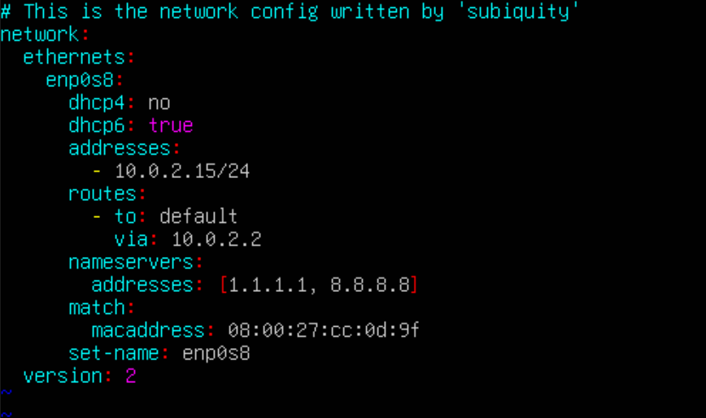

### Проверка SSH на нестандартном порту

Здесь зафиксирована проверка слушающих TCP-портов после настройки SSHD. Такой артефакт полезен, потому что показывает не только изменение конфигурации, но и проверку фактического состояния службы.

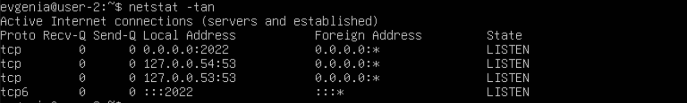

### Мониторинг процессов и ресурсов

Пример работы с `htop`: анализ процессов, сортировка и наблюдение за потреблением CPU. Это подтверждает практику базовой диагностики состояния сервера.

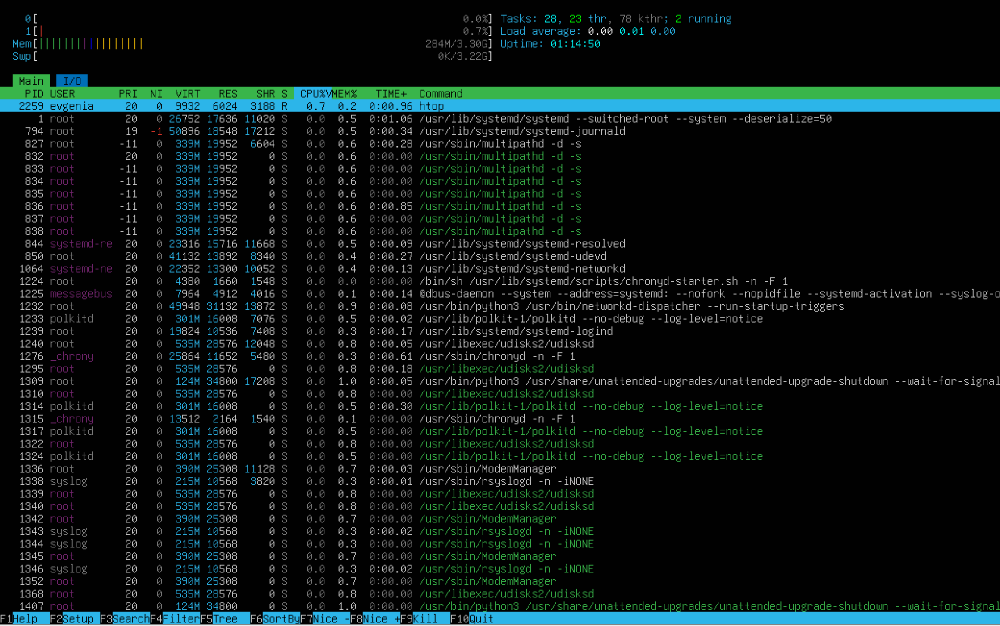

### Проверка события в системных журналах

Скриншот демонстрирует поиск события рестарта SSH-службы в логах. Это важно для эксплуатационного подхода: действие проверяется через наблюдаемый след в системе.

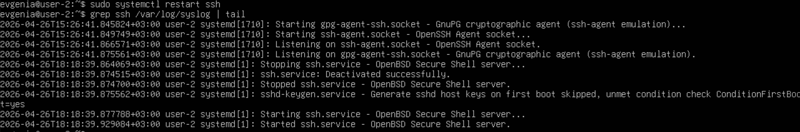

### Выполнение cron-задачи

Артефакт показывает, что задача по расписанию не только добавлена, но и реально выполнялась, что подтверждено системными журналами.

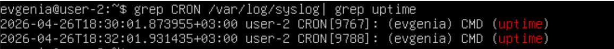

## Сетевое администрирование Linux

### Проверка маршрутизации между двумя VM

Скриншот подтверждает настройку маршрутов между двумя виртуальными машинами и проверку связности через ICMP.

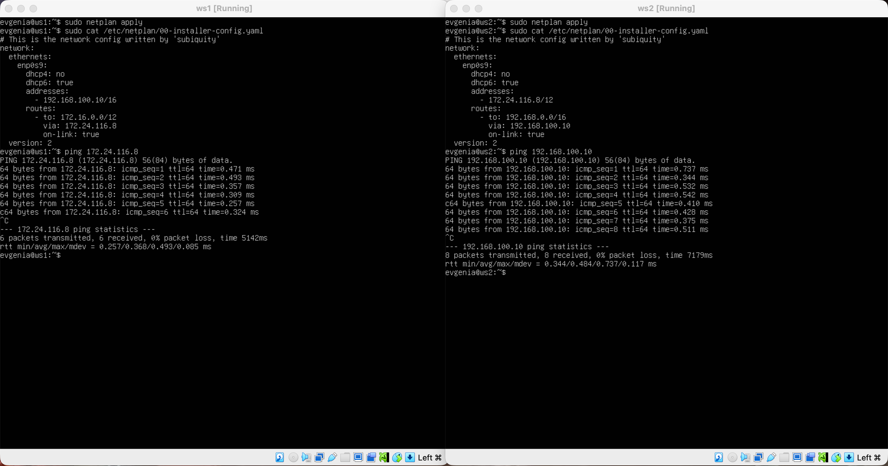

### Измерение пропускной способности через iperf3

Артефакт показывает практическое измерение скорости соединения между виртуальными машинами в обе стороны.

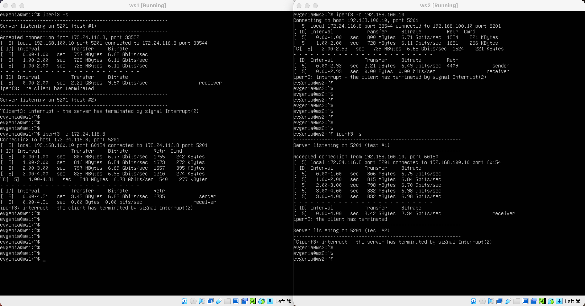

### Firewall и проверка состояния хоста

Скриншот показывает диагностику ситуации, когда ICMP может быть заблокирован, но хост при этом остается доступным. Для проверки используется `nmap`.

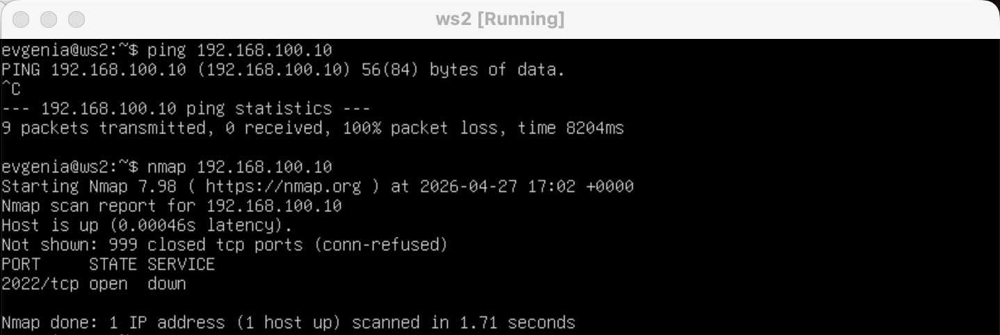

### Таблицы маршрутизации на Linux-роутерах

Этот артефакт показывает настройку маршрутов в многоузловой сети, где Linux-машины используются как маршрутизаторы между подсетями.

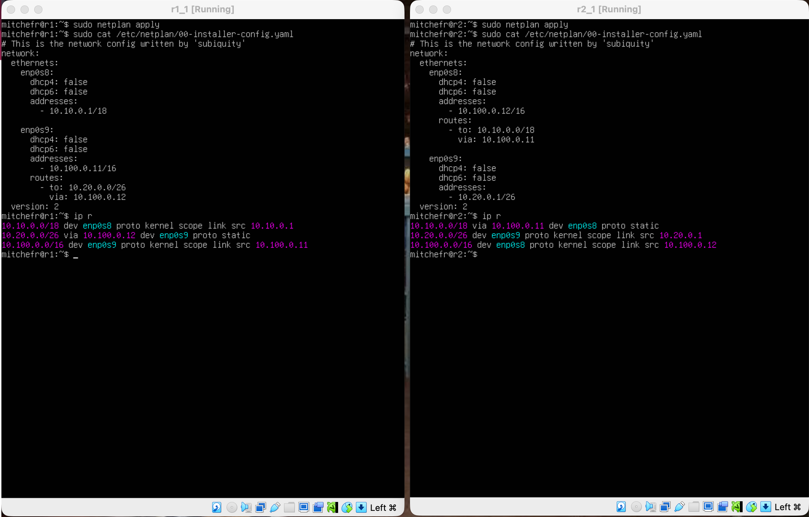

### DHCP и привязка адреса к MAC

Скриншот подтверждает настройку DHCP-сервера и сценарий с выдачей адреса по MAC-адресу клиента.

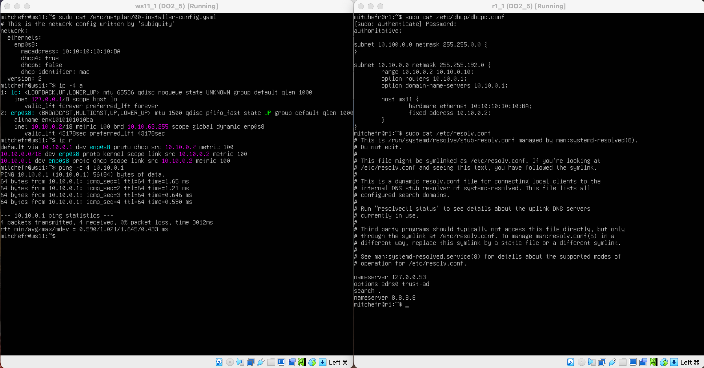

### NAT и проверка TCP-доступности

Артефакт показывает проверку SNAT/DNAT через TCP-подключение к Apache. Это демонстрирует практическую настройку трансляции адресов, а не только теоретическое понимание NAT.

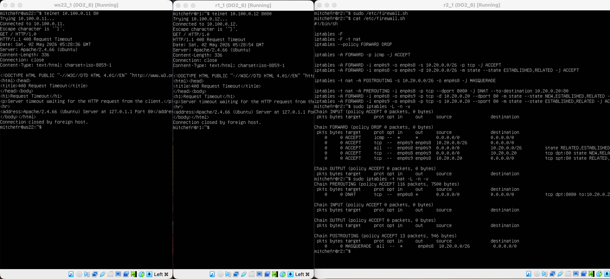
